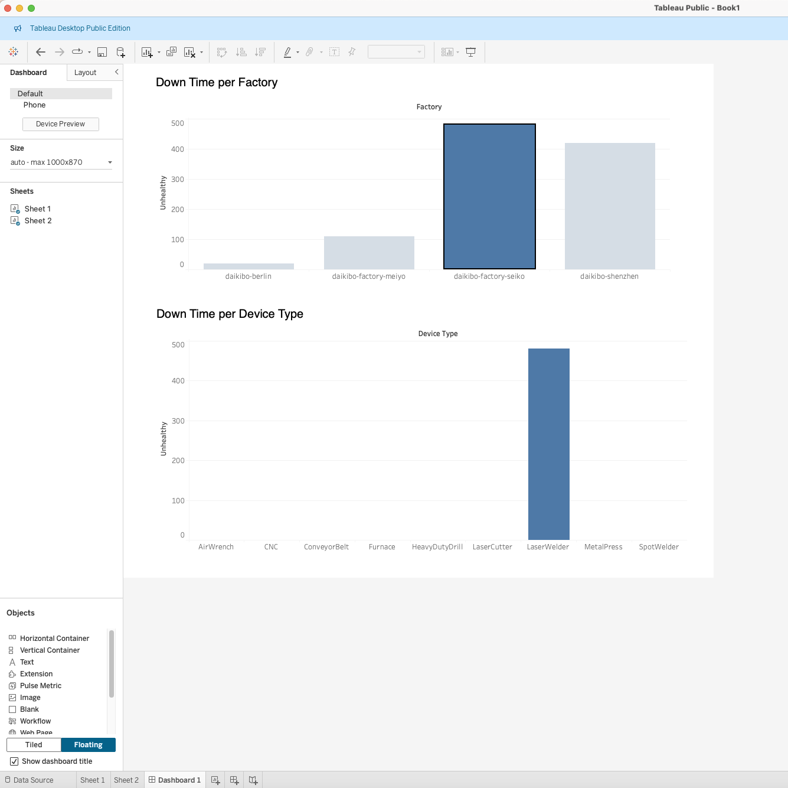

# Task 1 — Machine Down Time Analysis (Tableau)

## Business questions
1. In which factory location did machines break down the most?
2. Which machine/device type broke down most often in that location?

## Data
Daikibo's tech team merged one month (May 2021) of telemetry from 4 factories
into a single JSON file, ~160k messages sent every 10 minutes from 9 device
types per factory:

- Daikibo Factory Meiyo — Tokyo, Japan
- Daikibo Factory Seiko — Osaka, Japan
- Daikibo Berlin — Berlin, Germany
- Daikibo Shenzhen — Shenzhen, China

Each record looks like:

```json
{
  "deviceID": "19ff3161-2b3a-40a3-8604-bdc6532d0dab",
  "deviceType": "CNC",
  "timestamp": 1619816400000,
  "location": {
    "country": "japan",
    "city": "tokyo",
    "area": "keiyō-industrial-zone",
    "factory": "daikibo-factory-meiyo",
    "section": "section-1"
  },
  "data": {
    "status": "healthy",
    "temperature": 27
  }
}
```

The raw `daikibo-telemetry-data.json` file (~60 MB) is **not included in this
repo** — it's Forage-provided sample data, too large for a normal git repo,
and not needed to review the result. It can be downloaded from the Forage
Deloitte Data Analytics module if you want to reproduce the workbook.

## Method
1. Imported the JSON into Tableau (all schema levels expanded, so
   `location.factory`, `location.city`, etc. and `data.status` are individual
   fields).
2. Created a calculated field **`Unhealthy`**: `10` for every record where
   `data.status = "unhealthy"`, `0` otherwise — each unhealthy ping represents
   10 minutes of potential down time since the previous message.
3. Built a bar chart **"Down Time per Factory"** — `SUM(Unhealthy)` by
   `location.factory`.
4. Built a second bar chart on a new sheet, **"Down Time per Device Type"** —
   `SUM(Unhealthy)` by `deviceType`.
5. Combined both into a dashboard and set the factory chart as a filter, so
   clicking a factory's bar filters the device-type chart to that factory only.

## Result

The Tableau interactive dashboard : https://public.tableau.com/views/Book1_17906302365540/Dashboard1?:language=en-US&publish=yes&:sid=&:redirect=auth&:display_count=n&:origin=viz_share_link



- **Worst factory:** `daikibo-factory-seiko` (Osaka) — highest total down time
  (~470 min) of the 4 factories.
- **Worst device type at Seiko:** `LaserWelder` — accounts for effectively
  all of that factory's down time once filtered.

**Recommendation to the client:** prioritize maintenance/inspection of the
LaserWelder units at the Seiko factory — they're the single largest driver of
unplanned down time company-wide.
